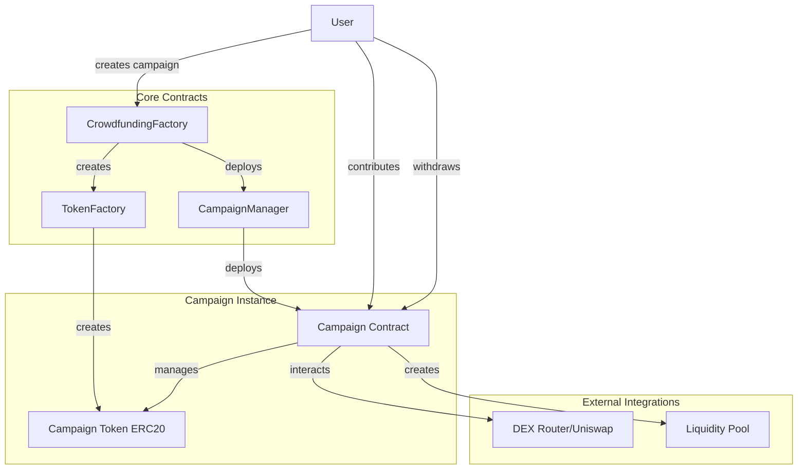
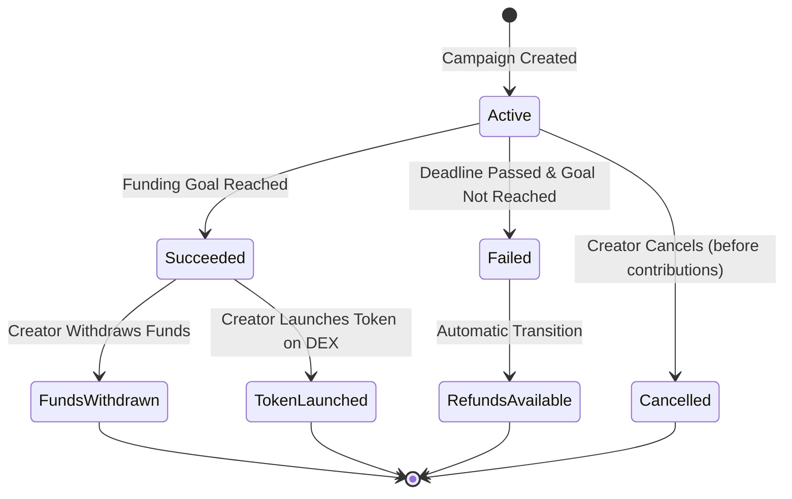

# Smart Contract Design for Decentralized Crowdfunding Platform

## 1. On-Chain vs Off-Chain Separation

### On-Chain Components (Smart Contracts)
- **Campaign creation and management**
- **Fund collection and escrow**
- **Token generation and distribution**
- **Withdrawal conditions and state management**
- **Liquidity pool creation on DEX**
- **Creator reserve allocation**
- **Refund mechanisms**

### Off-Chain Components (Application Layer)
- **Campaign metadata and descriptions**
- **User profiles and KYC**
- **Project updates and communications**
- **UI/UX interactions**
- **Analytics and reporting**
- **Social features and comments**

## 2. Contract Architecture



### Contract Responsibilities

#### CrowdfundingFactory
- Deploy new campaign contracts
- Maintain registry of all campaigns
- Set global parameters and fees
- Upgrade mechanism for new campaign versions

#### CampaignManager
- Template for individual campaigns
- Handle campaign lifecycle
- Manage funding and withdrawal logic
- Token distribution mechanics

#### TokenFactory
- Deploy ERC-20 tokens for campaigns
- Standard token template with campaign-specific parameters
- Token metadata and supply management

#### Campaign Contract (Instance)
- Individual campaign state management
- Fund collection and escrow
- Contribution tracking
- Withdrawal and refund logic
- Token distribution to backers

#### Campaign Token (ERC-20)
- Standard ERC-20 functionality
- Campaign-specific tokenomics
- Minting rights restricted to campaign contract

## 3. Core Data Structures

### Campaign Struct
```solidity
struct Campaign {
    address creator;
    string metadataURI;
    uint256 fundingGoal;
    uint256 deadline;
    uint256 totalRaised;
    uint256 creatorReservePercentage;
    uint256 liquidityPercentage;
    address tokenAddress;
    CampaignState state;
    WithdrawalCondition withdrawalCondition;
    bool allowEarlyWithdrawal;
}
```

### Contribution Struct
```solidity
struct Contribution {
    address contributor;
    uint256 amount;
    uint256 timestamp;
    uint256 tokenAllocation;
    bool claimed;
}
```

### Key Storage Variables
```solidity
// Campaign tracking
mapping(uint256 => Campaign) public campaigns;
mapping(uint256 => mapping(address => Contribution)) public contributions;
mapping(address => uint256[]) public creatorCampaigns;
mapping(address => uint256[]) public contributorCampaigns;

// Global settings
uint256 public platformFeePercentage;
address public feeRecipient;
uint256 public campaignCounter;
```

### Events
```solidity
event CampaignCreated(uint256 indexed campaignId, address indexed creator, address tokenAddress);
event ContributionMade(uint256 indexed campaignId, address indexed contributor, uint256 amount);
event TokensClaimed(uint256 indexed campaignId, address indexed contributor, uint256 amount);
event CampaignSucceeded(uint256 indexed campaignId, uint256 totalRaised);
event CampaignFailed(uint256 indexed campaignId, uint256 totalRaised);
event FundsWithdrawn(uint256 indexed campaignId, address indexed creator, uint256 amount);
event RefundIssued(uint256 indexed campaignId, address indexed contributor, uint256 amount);
event LiquidityPoolCreated(uint256 indexed campaignId, address indexed poolAddress);
```

## 4. Functions & Permissions

### Public/External Functions

#### CrowdfundingFactory
```solidity
function createCampaign(
    string memory metadataURI,
    uint256 fundingGoal,
    uint256 duration,
    uint256 creatorReservePercentage,
    uint256 liquidityPercentage,
    bool allowEarlyWithdrawal,
    string memory tokenName,
    string memory tokenSymbol
) external returns (uint256 campaignId)
```

#### Campaign Contract
```solidity
function contribute() external payable
function claimTokens() external
function withdrawFunds() external // Creator only
function refund() external
function createLiquidityPool() external // Creator only
function extendDeadline(uint256 newDeadline) external // Creator only (with conditions)
```

### Access Control
- **Creator Only**: withdrawFunds, createLiquidityPool, extendDeadline
- **Contributors Only**: claimTokens, refund
- **Anyone**: contribute, view functions
- **Owner Only**: setGlobalParameters, upgrades

### View Functions
```solidity
function getCampaignDetails(uint256 campaignId) external view returns (Campaign memory)
function getContribution(uint256 campaignId, address contributor) external view returns (Contribution memory)
function calculateTokenAllocation(uint256 campaignId, uint256 contributionAmount) external view returns (uint256)
function getCampaignState(uint256 campaignId) external view returns (CampaignState)
```

## 5. State Machine



### State Definitions
```solidity
enum CampaignState {
    Active,        // Campaign is live and accepting contributions
    Succeeded,     // Funding goal reached or deadline passed with early withdrawal allowed
    Failed,        // Deadline passed without reaching goal (no early withdrawal)
    FundsWithdrawn,// Creator has withdrawn funds
    TokenLaunched, // Token launched on DEX with liquidity
    Cancelled,     // Campaign cancelled by creator
    RefundsAvailable // Failed campaign, refunds can be claimed
}
```

### State Transition Rules
- **Active → Succeeded**: Funding goal reached OR (deadline passed AND allowEarlyWithdrawal = true)
- **Active → Failed**: Deadline passed AND allowEarlyWithdrawal = false AND goal not reached
- **Active → Cancelled**: Creator cancels before any contributions
- **Succeeded → FundsWithdrawn**: Creator chooses traditional withdrawal
- **Succeeded → TokenLaunched**: Creator chooses token launch path
- **Failed → RefundsAvailable**: Automatic transition for refund processing

## 6. Security Considerations

### Potential Risks & Mitigations

#### Reentrancy Attacks
- **Risk**: Malicious contracts calling back during fund transfers
- **Mitigation**: Use OpenZeppelin's ReentrancyGuard, checks-effects-interactions pattern

#### Integer Overflow/Underflow
- **Risk**: Mathematical operations causing unexpected results
- **Mitigation**: Use Solidity 0.8+ built-in overflow protection or SafeMath

#### Access Control Vulnerabilities
- **Risk**: Unauthorized function calls
- **Mitigation**: Implement robust role-based access control using OpenZeppelin's AccessControl

#### Front-Running
- **Risk**: MEV bots extracting value from contribution transactions
- **Mitigation**: Implement commit-reveal schemes for large contributions

#### Timestamp Manipulation
- **Risk**: Miners manipulating block timestamps
- **Mitigation**: Use block numbers instead of timestamps for critical deadlines

#### Creator Abandonment
- **Risk**: Creators disappearing after raising funds
- **Mitigation**: 
  - Implement milestone-based fund release
  - Creator token reservation aligns incentives
  - Community governance for failed projects

#### Token Economic Attacks
- **Risk**: Manipulation of token distribution or pricing
- **Mitigation**:
  - Fixed tokenomics set at creation
  - Transparent allocation formulas
  - Slippage protection for DEX interactions

#### Liquidity Pool Risks
- **Risk**: Impermanent loss, rug pulls
- **Mitigation**:
  - Optional liquidity lock mechanisms
  - Minimum liquidity requirements
  - Multi-signature controls for large pools

### Implementation Security Measures

```solidity
// Example security implementations
modifier onlyCreator(uint256 campaignId) {
    require(campaigns[campaignId].creator == msg.sender, "Not campaign creator");
    _;
}

modifier campaignExists(uint256 campaignId) {
    require(campaignId < campaignCounter, "Campaign does not exist");
    _;
}

modifier validState(uint256 campaignId, CampaignState expectedState) {
    require(campaigns[campaignId].state == expectedState, "Invalid campaign state");
    _;
}

// Reentrancy protection
function withdrawFunds(uint256 campaignId) external nonReentrant onlyCreator(campaignId) {
    // Implementation with checks-effects-interactions
}
```

### Additional Security Features
- **Emergency Pause**: Circuit breaker for critical vulnerabilities
- **Upgrade Mechanism**: Proxy pattern for contract upgrades
- **Rate Limiting**: Prevent spam attacks on contribution functions
- **Multi-signature**: For critical operations like parameter changes
- **Audit Trail**: Comprehensive event logging for all state changes

### Testing & Verification
- **Unit Tests**: Comprehensive test coverage for all functions
- **Integration Tests**: End-to-end workflow testing
- **Fuzzing**: Random input testing for edge cases
- **Formal Verification**: Mathematical proofs for critical invariants
- **Third-party Audits**: Professional security review before mainnet deployment