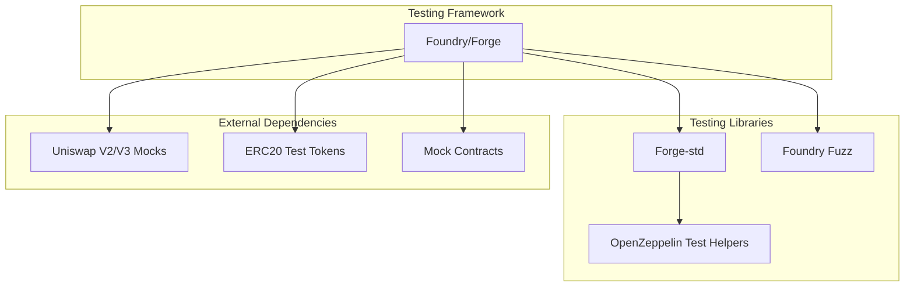

# Smart Contract Test Design for Decentralized Crowdfunding Platform

## Table of Contents

- [Testing Framework & Architecture](#testing-framework--architecture)
- [Test Organization Structure](#test-organization-structure)
- [Unit Testing Strategies](#unit-testing-strategies)
- [Integration Testing](#integration-testing)
- [Security & Edge Case Testing](#security--edge-case-testing)
- [Property-Based & Fuzz Testing](#property-based--fuzz-testing)
- [Test Utilities & Helpers](#test-utilities--helpers)
- [Testing Best Practices](#testing-best-practices)

## Testing Framework & Architecture

### Recommended Testing Stack



### Test Environment Setup

```solidity
// Base test contract
contract BaseTest is Test {
    // Common setup and utilities
    uint256 constant INITIAL_BALANCE = 100 ether;
    uint256 constant FUNDING_GOAL = 10 ether;
    uint256 constant CAMPAIGN_DURATION = 30 days;

    // Test accounts
    address deployer = makeAddr("deployer");
    address creator = makeAddr("creator");
    address contributor1 = makeAddr("contributor1");
    address contributor2 = makeAddr("contributor2");
    address maliciousUser = makeAddr("maliciousUser");
}
```

## Test Organization Structure

### Directory Structure

```
test/
├── unit/
│   ├── CrowdfundingFactory.t.sol
│   ├── CampaignManager.t.sol
│   ├── TokenFactory.t.sol
│   └── CampaignToken.t.sol
├── integration/
│   ├── CampaignLifecycle.t.sol
│   ├── TokenLaunch.t.sol
│   └── LiquidityPool.t.sol
├── security/
│   ├── ReentrancyAttacks.t.sol
│   ├── AccessControl.t.sol
│   └── EconomicAttacks.t.sol
├── fuzz/
│   ├── ContributionFuzz.t.sol
│   ├── StateMachineFuzz.t.sol
│   └── TokenomicsFuzz.t.sol
├── mocks/
│   ├── MockERC20.sol
│   ├── MockUniswapRouter.sol
│   └── MockMaliciousContract.sol
└── utils/
    ├── TestHelpers.sol
    └── Assertions.sol
```

## Unit Testing Strategies

### CrowdfundingFactory Tests

```solidity
contract CrowdfundingFactoryTest is BaseTest {

    describe("Campaign Creation") {
        function test_CreateCampaign_Success() public {
            // Test successful campaign creation
        }

        function test_CreateCampaign_InvalidParameters() public {
            // Test parameter validation
        }

        function test_CreateCampaign_Events() public {
            // Test event emission
        }
    }

    describe("Access Control") {
        function test_OnlyOwner_Functions() public {
            // Test owner-only functions
        }

        function test_SetGlobalParameters() public {
            // Test parameter updates
        }
    }

    describe("Campaign Registry") {
        function test_CampaignCounter_Increments() public {
            // Test counter logic
        }

        function test_GetCampaignsByCreator() public {
            // Test query functions
        }
    }
}
```

### Campaign Contract Tests

```solidity
contract CampaignTest is BaseTest {

    describe("Contribution Logic") {
        function test_Contribute_Success() public {
            // Valid contribution scenarios
        }

        function test_Contribute_AfterDeadline() public {
            // Should revert after deadline
        }

        function test_Contribute_ZeroAmount() public {
            // Should revert on zero contribution
        }

        function test_EarlyBackerBonus() public {
            // Test bonus token allocation
        }
    }

    describe("State Transitions") {
        function test_StateTransition_ActiveToSucceeded() public {
            // Test goal reached transition
        }

        function test_StateTransition_ActiveToFailed() public {
            // Test deadline without goal
        }

        function test_StateTransition_InvalidTransitions() public {
            // Test prevented transitions
        }
    }

    describe("Fund Withdrawal") {
        function test_WithdrawFunds_Creator() public {
            // Successful withdrawal
        }

        function test_WithdrawFunds_Unauthorized() public {
            // Non-creator attempt
        }

        function test_WithdrawFunds_WrongState() public {
            // Invalid state withdrawal
        }
    }

    describe("Token Distribution") {
        function test_ClaimTokens_Success() public {
            // Successful token claiming
        }

        function test_ClaimTokens_DoubleClaim() public {
            // Prevent double claiming
        }

        function test_TokenAllocation_Calculation() public {
            // Verify allocation math
        }
    }

    describe("Refund Mechanism") {
        function test_Refund_FailedCampaign() public {
            // Refund for failed campaign
        }

        function test_Refund_SuccessfulCampaign() public {
            // Should revert for successful
        }
    }
}
```

### Token Factory Tests

```solidity
contract TokenFactoryTest is BaseTest {

    describe("Token Deployment") {
        function test_DeployToken_Success() public {
            // Successful token creation
        }

        function test_DeployToken_UniqueAddresses() public {
            // Each deployment unique
        }

        function test_TokenMetadata_Correct() public {
            // Name, symbol, decimals
        }
    }

    describe("Token Configuration") {
        function test_InitialSupply_Zero() public {
            // Tokens start with zero supply
        }

        function test_MintingRights_Restricted() public {
            // Only campaign can mint
        }
    }
}
```

## Integration Testing

### Campaign Lifecycle Tests

```solidity
contract CampaignLifecycleTest is BaseTest {

    function test_FullLifecycle_TraditionalWithdrawal() public {
        // 1. Create campaign
        // 2. Multiple contributions
        // 3. Reach funding goal
        // 4. Creator withdraws funds
        // 5. Contributors claim tokens
        // 6. Verify final state
    }

    function test_FullLifecycle_TokenLaunch() public {
        // 1. Create campaign
        // 2. Contributions with early bonuses
        // 3. Campaign succeeds
        // 4. Creator launches token on DEX
        // 5. Liquidity pool creation
        // 6. Token trading enabled
    }

    function test_FailedCampaign_RefundFlow() public {
        // 1. Create campaign
        // 2. Partial contributions
        // 3. Deadline passes without goal
        // 4. Campaign marked as failed
        // 5. Contributors get refunds
        // 6. No tokens distributed
    }
}
```

### DEX Integration Tests

```solidity
contract TokenLaunchTest is BaseTest {

    function test_LiquidityPool_Creation() public {
        // Test Uniswap pool creation
    }

    function test_InitialLiquidity_Calculation() public {
        // Verify liquidity amounts
    }

    function test_TokenPrice_Initial() public {
        // Test initial price setting
    }

    function test_LiquidityLock_Mechanism() public {
        // Test optional liquidity locking
    }
}
```

## Security & Edge Case Testing

### Reentrancy Attack Tests

```solidity
contract ReentrancyAttackTest is BaseTest {

    function test_Contribute_ReentrancyProtection() public {
        // Deploy malicious contract
        // Attempt reentrancy during contribution
        // Verify protection works
    }

    function test_Withdraw_ReentrancyProtection() public {
        // Test withdrawal reentrancy protection
    }

    function test_Refund_ReentrancyProtection() public {
        // Test refund reentrancy protection
    }
}
```

### Access Control Tests

```solidity
contract AccessControlTest is BaseTest {

    function test_CreatorOnly_Functions() public {
        // Test all creator-only functions
        // Verify unauthorized access fails
    }

    function test_OwnerOnly_Functions() public {
        // Test factory owner functions
    }

    function test_RoleTransfer_Scenarios() public {
        // Test ownership transfers
    }
}
```

### Economic Attack Tests

```solidity
contract EconomicAttackTest is BaseTest {

    function test_FlashLoan_Attack() public {
        // Test flash loan manipulation
    }

    function test_FrontRunning_Protection() public {
        // Test MEV protection
    }

    function test_Sandwich_Attack() public {
        // Test DEX sandwich attacks
    }

    function test_TokenInflation_Attack() public {
        // Test token supply manipulation
    }
}
```

### Edge Cases

```solidity
contract EdgeCaseTest is BaseTest {

    function test_ExtremeValues() public {
        // Max uint256 values
        // Zero values
        // Boundary conditions
    }

    function test_TimestampManipulation() public {
        // Test deadline edge cases
        // Block timestamp variations
    }

    function test_GasLimits() public {
        // Test gas optimization
        // Large array operations
    }

    function test_ContractSize_Limits() public {
        // Test contract size constraints
    }
}
```

## Property-Based & Fuzz Testing

### Contribution Fuzz Tests

```solidity
contract ContributionFuzzTest is BaseTest {

    function testFuzz_Contribute_RandomAmounts(uint256 amount) public {
        // Assume valid range
        vm.assume(amount > 0 && amount <= 1000 ether);

        // Test contribution with random amounts
        // Verify invariants hold
    }

    function testFuzz_MultipleContributions_RandomOrder(
        uint256[] memory amounts,
        address[] memory contributors
    ) public {
        // Test random contribution patterns
        // Verify total raised accuracy
    }
}
```

### State Machine Fuzz Tests

```solidity
contract StateMachineFuzzTest is BaseTest {

    function testFuzz_StateTransitions_ValidPaths(uint8 action) public {
        // Random valid state transitions
        // Verify state consistency
    }

    function testFuzz_InvalidTransitions_ShouldRevert(
        uint8 currentState,
        uint8 action
    ) public {
        // Test invalid transitions always revert
    }
}
```

### Tokenomics Fuzz Tests

```solidity
contract TokenomicsFuzzTest is BaseTest {

    function testFuzz_TokenAllocation_Fairness(
        uint256 totalContributions,
        uint256[] memory individualContributions
    ) public {
        // Test proportional token allocation
        // Verify no rounding errors accumulate
    }

    function testFuzz_CreatorReserve_Percentage(uint8 reservePercent) public {
        vm.assume(reservePercent <= 50); // Max 50% reserve

        // Test various reserve percentages
        // Verify correct allocation
    }
}
```

## Test Utilities & Helpers

### Test Helper Contract

```solidity
contract TestHelpers is Test {

    function createMockCampaign(
        address creator,
        uint256 goal,
        uint256 duration
    ) internal returns (uint256 campaignId) {
        // Helper to create standard test campaigns
    }

    function simulateContributions(
        uint256 campaignId,
        address[] memory contributors,
        uint256[] memory amounts
    ) internal {
        // Helper to simulate multiple contributions
    }

    function fastForwardToDeadline(uint256 campaignId) internal {
        // Helper to advance time to deadline
    }

    function assertCampaignState(
        uint256 campaignId,
        CampaignState expectedState
    ) internal {
        // Custom assertion for campaign state
    }
}
```

### Mock Contracts

```solidity
contract MockUniswapRouter {
    function addLiquidity(
        address tokenA,
        address tokenB,
        uint amountADesired,
        uint amountBDesired,
        uint amountAMin,
        uint amountBMin,
        address to,
        uint deadline
    ) external returns (uint amountA, uint amountB, uint liquidity) {
        // Mock implementation for testing
    }
}

contract MockMaliciousContract {
    bool public attackActive;

    function contribute() external payable {
        if (attackActive) {
            // Attempt reentrancy
        }
    }

    receive() external payable {
        if (attackActive) {
            // Reentrancy attempt
        }
    }
}
```

## Testing Best Practices

### Test Organization Principles

1. **AAA Pattern**: Arrange, Act, Assert

```solidity
function test_Example() public {
    // Arrange
    uint256 campaignId = createTestCampaign();

    // Act
    campaign.contribute{value: 1 ether}();

    // Assert
    assertEq(campaign.totalRaised(), 1 ether);
}
```

2. **Single Responsibility**: One test, one behavior
3. **Clear Naming**: `test_Function_Condition_ExpectedResult`
4. **Comprehensive Coverage**: Happy path, edge cases, failures

### Test Coverage Goals

- **Line Coverage**: >95%
- **Branch Coverage**: >90%
- **Function Coverage**: 100%
- **Critical Path Coverage**: 100%

### Performance Testing

```solidity
contract PerformanceTest is BaseTest {

    function test_Gas_OptimalContribution() public {
        uint256 gasBefore = gasleft();
        campaign.contribute{value: 1 ether}();
        uint256 gasUsed = gasBefore - gasleft();

        // Assert gas usage within limits
        assertLt(gasUsed, 100000);
    }

    function test_ScalabilityLimits() public {
        // Test with maximum contributors
        // Verify gas doesn't exceed block limit
    }
}
```

### Invariant Testing

```solidity
contract InvariantTest is BaseTest {

    function invariant_TotalRaised_EqualsContributions() public {
        // Total raised should always equal sum of contributions
    }

    function invariant_TokenSupply_MatchesAllocations() public {
        // Token supply should match total allocations
    }

    function invariant_ContractBalance_Consistency() public {
        // Contract balance should match accounting
    }
}
```

### Continuous Integration

```yaml
# .github/workflows/test.yml
name: Smart Contract Tests
on: [push, pull_request]

jobs:
  test:
    runs-on: ubuntu-latest
    steps:
      - uses: actions/checkout@v3
      - name: Install Foundry
        uses: foundry-rs/foundry-toolchain@v1
      - name: Run tests
        run: forge test --gas-report
      - name: Run coverage
        run: forge coverage --report lcov
      - name: Upload coverage
        uses: codecov/codecov-action@v3
```

### Test Reporting & Metrics

1. **Coverage Reports**: Track test coverage trends
2. **Gas Reports**: Monitor gas optimization
3. **Performance Metrics**: Execution time tracking
4. **Security Audits**: Regular security test runs
5. **Mutation Testing**: Test the tests themselves

This comprehensive test design ensures robust, secure, and reliable smart contract implementation with thorough coverage of all functionality, edge cases, and potential attack vectors.
